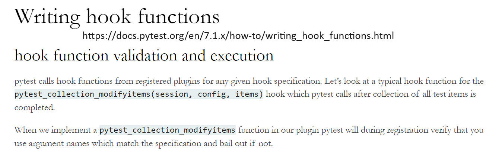

https://happytest-apidoc.readthedocs.io/en/stable/writing_plugins.html

`python -m pytest -vs --debug` gives output of hooks

Some hooks are wrap @pytest.hookimpl(hookwrapper=True) as they wrap other hooks (see article at top)

I have made a Markdown file of this tree in hook_tree_in_markdown.md

When PyTest runs certain functions, it looks for similar named function with *similar arguments*. If there is a match it will then run our function at the same point in the run:

These are hooks.

Under the hood, PyTest uses Pluggy to create a plugin based architecture: <https://pluggy.readthedocs.io/en/stable/index.html>

The challenging part is finding more information on how to access the methods and properties of these hooks.

The PyTest docs and source code help with this as well as looking at existing plugins.