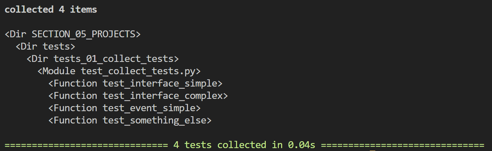

## Creating a CSV of all tests that will be run

Let's refresh markers, keywords and nodeid...

If we run test with the --collect-only flag we get a list of all test that will be run:

pytest-collect-only-flag.png 

`pytest_collection_modifyitems` hook gathers all the tests prior to running tests. 

We can output this to a CSV along with infomation on keywords used in the test.
`python -m pytest -vs .\tests\tests_01_collect_tests\test_collect_tests.py::test_something_else`

Use 09 to show that it does this in real time...
